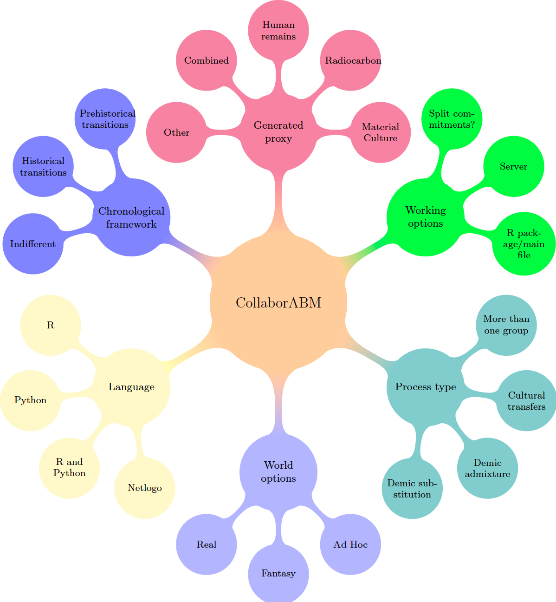

## Brain map collaborABM

{ width: 200px; }

# Comments

## Programming language

**R**. Could use this project for further development. Create a R-package? Use of [Rbookdown](https://bookdown.org/yihui/bookdown/get-started.html) to document the model and share the whole process?\
**Python**. More options 'out there'.\
**Netlogo**. Already set.\
**R & Python**. We have coders in R and Python. Could do the model in both and that way (1) it will be easier to share it and (2) we can test performance in each (not that this is anything new...))

## World options
**Real World**. Easier, but some researchers could feel inclined to use their background knowledge.\
**Fantasy**. Freak, true, but still cool\
***Ad Hoc***. Generate a world dealing with our specific problem. From DTMs to patches.

## Process type
**Demographic substitution**. Complete population replacement.\
**Demographic admixture**. Partial population replacement.\
**Cultural transfers**. No population replacement.\
**More than one group**. Mixed processes.

## Generated proxy
**Material Culture**. If we want to focus on cultural transmission.\
**Radioccarbon**. If we want to focus on demography.\
**Human remains**. Also demography.\
**Combined**.\
**Other**.

## Chronological framework

**Prehistorical transitions**. Meso-Neo?\
**Historical transitions**. There are many, but I'm not sure if we have real data (or knowledge) for this.\
**Indifferent**. Perhaps not even setting a pre-defined chronological framework.\

## Working options
**Server**. In case we don't want to use githup and we want to do other options, like working against a server.\
**R package/main file**. We could work all committing to a single main file, work with branches or perhaps divide the model by functions with the scope of creating a package once it is done.\
**Split commitments?**. De we want to work 'everyone on everything' or do we prefer to separate and take charge of different tasks?

## Further comments
1. Take into account environmental conditions?\
2. Perhaps thinking of not complicating it too much
