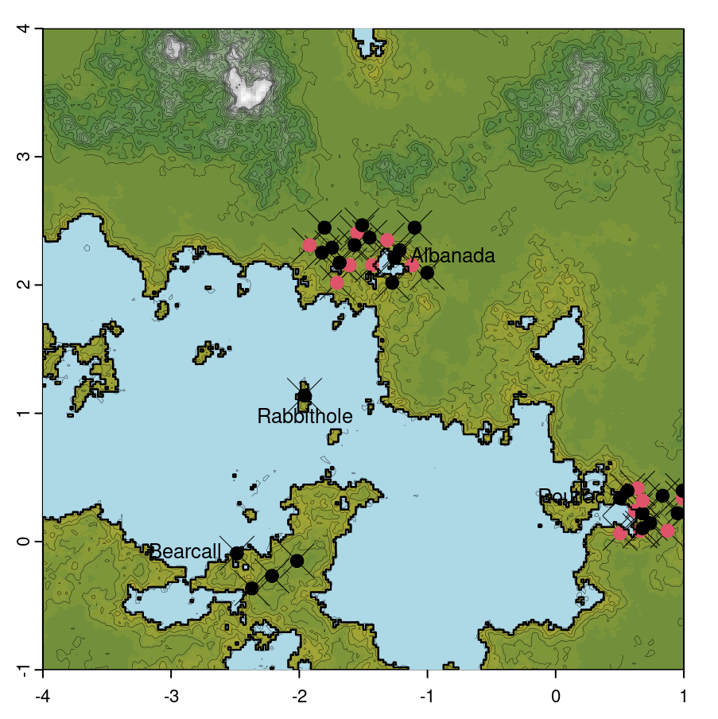
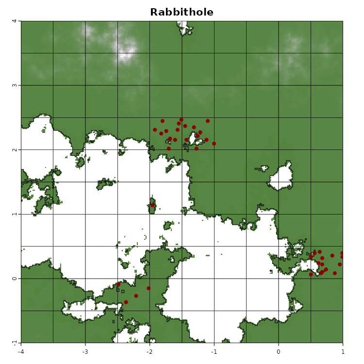

# The Archaeoriddle

If you don't know where to start, you may want to have a look at [thearchaeoriddle.com](https://thearchaeoriddle.org/)

## Preamble

The Archaeoriddle Project is a project that has implemented and developed by the [Computational and Digital Archaeology Lab](https://www.arch.cam.ac.uk/research/laboratories/cdal) at the McDonald Institute at the university of Cambridge, following ideas by Enrico Crema and Xavier Rubio-Campillo. It has been made possible mainly thanks to a grant from the British Academy (SRG2223\230262), but would not have been possible without the support of the Marie Slobodwska-Curie (H2020-MSCA-IF No. 101020631/ArchBiMod), and the ENCOUNTER project (ERC grant agreement No 801953).

This repository compile together all the elements developed throughout this project. They can be divided in three main components, that are all detailed later in this file.

1. [The Bookdown](#the-bookdown) : a compiled version is available online [here](www.thearchaeoriddle.com). This standalone document details every aspect of the project. It should allow the reproduction and exploration of every aspect of the project (:file_folder: [./doc/bookdown/](./doc/bookdown/)).
2. [The Original Challenge](#the-original-challenge) one instance of archaeoriddle's simulation, including the website, data and 5 participants contribution (:file_folder: [./doc/shinyapp/](./doc/shinyapp/) & [./doc/bookdown/data_original/](./doc/bookdown/data_original/)).
2. [The R package](#the-r-package) : contains all the above and the underlying R-functions, tests and associated documentation (:file_folder: [./](./))

This repository has the structure of an R package. This allows each sub-component of the Archaeoriddle to easily use and call functions and data shared common to the different part of the project. It also greatly simplify the use of the different functions used throughout the bookdown for anyone who would like to play and recreate its own archaeoriddle.

*Note:* The version v0.1 of this repository is the version that has been shared with reviewers during the revision process of the paper "Assessing the inferential power of quantitative methods in archaeology via simulated datasets: the archaeoriddle challenge", by:
Cortell-Nicolau,  Carrignon, S., Rodíguez-Palomo, I, Hromada,  Kahlenberg, R , Mes, A Priß, D, Yaworsky, P, Zhang, X, Brainerd, L, Lewis, J, Redhouse, D, Simmons, C, Coto-Sarmiento, M, Daems, D, Deb, A, Lawrence D, O’Brien, M, Riede, F, Rubio-Campillo, X, Crema, E.

This version includes the modifications asked by the reviewers and is the one archived on zenodo with the DOI: . 

## The Bookdown

The bookdown is available online at: [www.thearchaeoriddle.org](https://www.thearchaeoriddle.org). It is associated with a [forum](https://www.thearchaeoriddle.org/forum) that allows anyone interested to discuss the project, address issues encountered while using the package or simply curious to explore and exchange about inference in archaeology in general,

The Archaeoriddle bookdown guides you through the entire Archaeoriddle project, allowing you to follow everything that has been done, which models have been chosen at different level and why. Coupled with the functions provided by [the R package](#the-r-package), you will be able to use the provided code chunks to reproduce every element yourself, and create your own world, with its unique mountains, seas, and islands. You will be able generate settlements, with populations that fluctuate based on parameters you will choose. The bookdown also facilitates recreating your own [challenge](#the-original-challenge),  to generate your own radiocarbon deposits and create output files to share with students or colleagues and find out who can infer your original parameters.

The source for the bookdown is stored in `doc/bookdown/`. This folder contains all the files and documents needed to compile the Archaeoriddle's bookdown. It also houses the output and original files shared for the original Archaeoriddle's challenge.

If you want to compile the bookdown yourself, we invite you to read [this chapter](https://thearchaeoriddle.org/index.html#compiling-the-book) of the bookdown.

### Useful files & folders for this component:

- [:file_folder: doc/bookdown/](./doc/bookdown/) : the main folder
    - [:file_folder: data_original/](./doc/bookdown/data_original/) : folder with data of the original challenge ([cf below](the-original-challenge)
    - [:file_folder: fakedata/](./doc/bookdown/fakedata/): legacy folder with all csvs of the original challenge
    - [📄 01_Introduction.Rmd](./doc/bookdown/01_Introduction.Rmd) to [09_thearchaeoriddle.Rmd](./doc/bookdown/09_thearchaeoriddle.Rmd): RMarkdown file with each chapter of the bookdown.
    - [📄 README.md](./doc/bookdown/README.md) : README specific for the bookdown
    - [📄 dateGeneration.R](./doc/bookdown/dateGeneration.R) : R script to automatically generate dates from record of population size through time
    - [📄 exploreDate.R](./doc/bookdown/exploreDate.R) : R script for exploring and analyzing date-related data.
    - [📄 index.Rmd](./doc/bookdown/index.Rmd) : Preface of the bookdown, initialise a few thing, load needed package,...
    - [📄 packages.bib](./doc/bookdown/packages.bib) : Bibliography listing reference and package used for the bookdown.
    - [📄 scriptmini.R](./doc/bookdown/scriptmini.R) : minimal exemple of how to rune one simulation and save the results.
    - [📄 smallscript.md](./doc/bookdown/smallscript.md) : describe a few one liners to run multiple simulations to explore them before selecting a good one
    - [💾 testsites.RDS](./doc/bookdown/testsites.RDS) : Not used
    - [📄 tools.R](./doc/bookdown/tools.R) : serie of function, to be deleted as they should be all in `./R/`

If you compile the bookdown yourself, some folder will be generated (`data_tmp` and `data_toshare`) that will be used to store file generated during the compilation (the new world, csv outputs, etc...).

## The Original Challenge 

The Original Challenge correspond to a specific instance of the archaeoriddle, called 'Rabbithole'. This includes : a landscape, an 'ecological map', a set of parameters that have been used to carry set of simulations among which  _one_ has been chosen. From the outcome of the simulation, carbon deposit have been generated and csv with list of C14 dates create. The map of the landscape and the ecological raster, togethe with a select set of csv file among these generated where shared  publicly with archaeologists via an online website. The website is still available [here](https://theia.arch.cam.ac.uk/archaeoriddle/) on the 1st of November 2024, but will probably disappear anytime soon ; but the source to generate the website are provided in this repository [here](./doc/shinyapp/).

On the website, three research questions were asked:

- RQ1. What was the relationship between the two groups? Was it peaceful or hostile?
- RQ2. What was the population trajectory of each group?
- RQ3. What was the rate of dispersal of poppy chewers?

Via the website, everyone had access to fou squares representing 4 zones of 'Rabbithole' from which data about occupation was given. People who wanted to participate were then able to request five additional zones that will be 'excavated' for them and they then received datasets covering the zones they picked. 

  <figure>
    
    
 
    <figcaption style="font-size:5pt"> Map of Rabbithole, on the left with name of the settlement, on the right with the square available</figcaption>
  </figure>

The original challenge received 5 proposals that can be explore via the links below:

### Proposals

#### P1 by Deborah Priß and Raphael Kahlenberg

Authors used agent-based modeling combined with exploratory data analysis to study dispersal and site preference in Rabbithole, using ArcGIS Pro and R for calibration and trajectory computation, resulting in an ABM built with NetLogo that correctly predicted group interactions and movements but revealed discrepancies in expansion rates due to differing population trajectories.

**Source:** https://github.com/dpriss/Archaeoriddle_Kahlenberg_Priss

**Citation:**

#### P2 by Xuan Zhang

The author employed point-process modeling to predict potential occupation and assess conflict between groups, finding increased hostilities and mortality over time due to growing populations and settlements, despite non-time-dependent hostility rules.

**Source:** https://github.com/Xuan-Zhang-arc/Archaeoriddle_PPM_HG_F_relationship/

**Citation:** Xuan Zhang. (2024). _Using Point Process Modelling to detect cooperation vs competition (Archaeoriddle RQ1) (Archaeoriddle)._ Zenodo. https://doi.org/10.5281/zenodo.12803445

#### P3 by Peter Yaworsky

The author utilized species-distribution modeling in R to develop a four-stage approach that successfully modeled historical population distributions and dispersal patterns of farmers and foragers, highlighting a southerly to northerly farming dispersal and a decline in hunter-gatherer populations.

**Source:** https://doi.org/10.5281/zenodo.8260754

**Citation:** Yaworsky, P. (2023). _Archeo-Riddle Submission 2023._ Zenodo. https://doi.org/10.5281/zenodo.8260754

#### P4 by Alexes Mes:

The author employed a friction-based strategy and hierarchical Bayesian phase modeling in R to analyze and successfully predict the complex dispersal patterns and expansion rates of Poppy-chewers in Rabbithole, incorporating spatial and environmental factors.

**Source:** https://github.com/AlexesMes/Archeaoriddle_RabbitWorld

**Citation:** https://github.com/AlexesMes/Archeaoriddle_RabbitWorld

#### P5 by Daniel Hromada

The author used a qualitative analysis to infer hostility between cultures A and B by comparing the shorter settlement persistence of culture A in region R_B, separated by a sea, to its persistence in other regions under equal conditions.

**Source:**

**Citation:**

The original challenge is detailed in [this chapter](https://thearchaeoriddle.org/original-challenge.html) of the bookdown.

### Useful files & folders for this component:

- [:file_folder: doc/shinyapp/](./doc/shinyapp/) : the code of  shiny app (the one behind the site available [here](https://theia.arch.cam.ac.uk/archaeoriddle))
- [📄 doc/shinyapp/README.md](./doc/shinyapp/README.m) : README explaining how to recreate the shiny app and detailing the files available in the folder
- [:file_folder: doc/fake_papers/](./doc/fake_papers/) :  latex code for sever fake papers and poster presented in conferences where the Original Challenge was presented.
- [:file_folder: doc/bookdown/data_original/](./doc/bookdown/data_original/) : folder will all orignal
    - [:file_folder: general_results_selected_simu/](./doc/bookdown/data_original/general_results_selected_simu/) :
        - [💾 buffattack300_K110_PSU065_3_all.RDS](./doc/bookdown/data_original/general_results_selected_simu/buffattack300_K110_PSU065_3_all.RDS) : RDS file store most of the selected simulation
        - [💾 buffattack300_K110_PSU065_3_sitesRast.RDS](./doc/bookdown/data_original/general_results_selected_simu/buffattack300_K110_PSU065_3_sitesRast.RDS) : RDS file storing a raster with the positions of the sites
        - [💾 buffattack300_K110_PSU065_3_dates.RDS](./doc/bookdown/data_original/general_results_selected_simu/buffattack300_K110_PSU065_3_dates.RDS) : RDS file storing all dates generated for all sites generated.
    - [:file_folder: sitesinitialposition/](./doc/bookdown/data_original/sitesinitialposition/) : Folder with file needed to read shapefile
        - [🌐 sitesinitialposition.shp](./doc/bookdown/data_original/sitesinitialposition/sitesinitialposition.shp) : shapefile with the position of the initial sites.
    - [🌐 costline.shp ](./doc/bookdown/data_original/coastline.shp) : shapefile defining the coastline of the world
    - [🗺️ east_narnia4x.tiff](./doc/bookdown/data_original/east_narnia4x.tif) : DEM raster with elevation of Rabbithole
    - [🗺️ resources.tiff](./doc/bookdown/data_original/resources.tiff/) : raster with the ecological fitness of the environment

## The R-Package 

This overal structure of this repository is a R package. 
To install it, the most simple way will be by using `devtools` function `github_install()` by doing: `devtools::install_github("acortell3/archaeoriddle")`.
Most of the functions defined in the package are described in details in [the bookdown](https://www.thearchaeoriddle).

The package will be used if you want to follow the bookdown or recompile it. It will also allows you to easily re-use the functions defined in the package to re-explore the proposal of the original challenge, create your own model of interaction, explore and modify the underlying model used throughout the Archaeoriddle project.

To install the package, the easiest is probably to use `devtools` function `install_github`: `devtools::install_github("acortell3/archaeoriddle")` 

## Full file structure:

- [:file_folder: doc/](./doc/): documents, websites,... (cf below)
- [:file_folder: div/](./div/): various script
    - [📄 post-receive-hook](./div/post-receive-hook): a script that can be use to automatically deploy the bookdown when pushes are made to a git repository 
- [:file_folder: .github/](./.github/): github specific files
    - [📄 .github/workflows/deploy_bookdown.yml](./.github/workflows/deploy_bookdown.yml): a yaml file to automatically deploy the bookdown via github pages
- [:file_folder: man/](./man/): R documentation (cf below)
- [:file_folder: R/](./R/): source file of R package (cf below)
- [📄 DESCRIPTION](./DESCRIPTION): R-package related file
- [📄 archaeoriddle.Rproj](./archaeoriddle.Rproj): R-package related file
- [📄 NAMESPACE](./NAMESPACE): R-package related file
- [📄 README.md](./README.md): R-package related file

### `doc/`

- [:file_folder: doc/bookdown/](./doc/bookdown/): cf section [The Bookdown](#the-bookdown)
- [:file_folder: doc/shinyapp/](./doc/shinyapp/): cf section [The Original Challenge](#the-original-challenge)
- [:file_folder: doc/tex_files/](./doc/tex_files//): a few `tex` files used to layout ideas
- [🖼️  brain_map_colabm.png](./doc/brain_map_colabm.png) : image representing early reflections about the project
- [📄 Explanation_of_ideas_brain_map.md](./doc/Explanation_of_ideas_brain_map.md): Markdown file detailing programming languages, world options, and more.
- [📄 interactive_brain_map.md](./doc/interactive_brain_map.md): Markdown guide for using Markmap visualization; contains programming language options and more.
- [📄 pop_id.Rmd](./doc/pop_id.Rmd): R Markdown file about population ideas and environmental qualities for hunting/farming.

### `man/`
- [📄 A_rates.Rd](./man/A_rates.Rd),[📄 Gpd.Rd](./man/Gpd.Rd),... and all other `Rd` files: files automatically generated by `ROxygen` to generate `R` documentation (shown when using `?Gpd` when the package is loaded`

### `R/`

- [📄 anthropogenic_deposition.R](./R/anthropogenic_deposition.R): Simulates anthropogenic bone deposition rates at a site.
- [📄 climate.R](./R/climate.R): Generates power law noise and simulates environmental fluctuations.
- [📄 init_simulation.R](./R/init_simulation.R): Initializes carrying capacities, population matrices, and site lists for simulations.
- [📄 logistic_decay.R](./R/logistic_decay.R): Applies logistic decay to resources around points in a raster.
- [📄 natural_deposition.R](./R/natural_deposition.R): Models deposition and post-deposition effects of archaeological materials.
- [📄 perlin_noise.R](./R/perlin_noise.R): Creates Perlin noise for 2-D slope and elevation autocorrelation.
- [📄 population.R](./R/population.R): Manages stochastic population dynamics, growth, and mortality.
- [📄 record_loss.R](./R/record_loss.R): Simulates taphonomic losses in archaeological records.
- [📄 run_simulation.R](./R/run_simulation.R): Runs a simulation of cultural interactions, migration, and conflicts.
- [📄 tools.R](./R/tools.R): Utility functions for visualization, data extraction, and map plotting.

